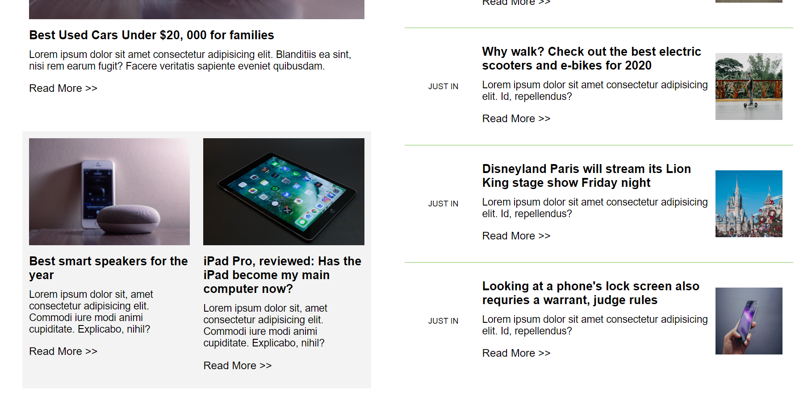
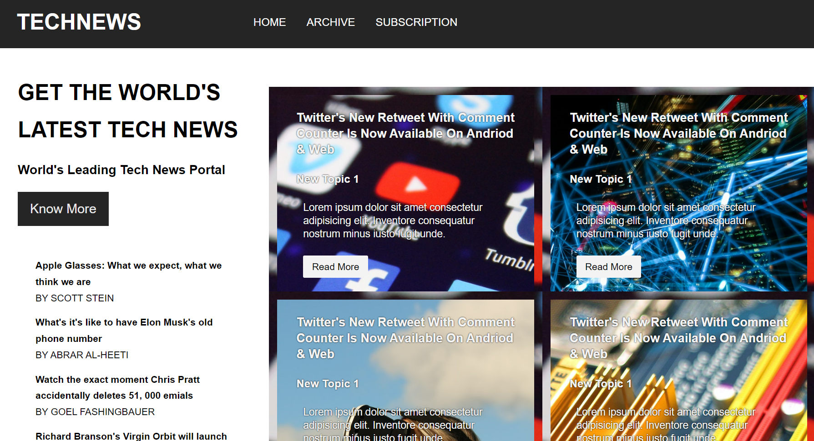

# A Newslwtter Website.

A complete Newsletter Website that has the following features

# Uses HTML and CSS to create a responsive website that includes
 ** Home page: Provide an overview of the newsletter and include a navigation menu to 
access other pages.
 **Archive page: This page displays a list of past newsletter issues with their titles and publication dates.
 **Subscription page: This page  allows users to subscribe to the newsletter by providing their email 
address and a confirmation button.

# Use CSS to style the website.
# Use CSS opacity, transitions, and animation to add visual effects to the website. 
# Use CSS Flexbox to create a responsive design that adapts to different screen sizes and devices
# Use CSS text effects to add visual interest and emphasis to the website. For example, you can use text shadows, 
gradients, and animations to create dynamic and engaging text

After getting the starter files, you need to go the file directory

and click on the Files with .html to view them 

